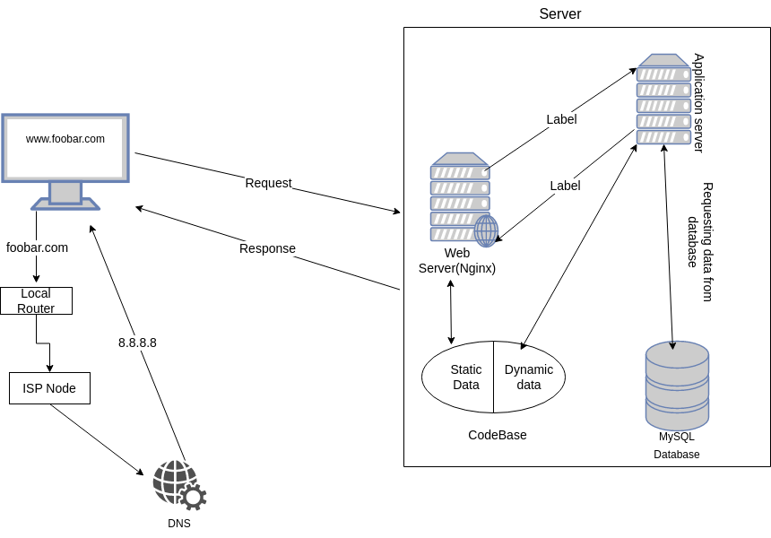

# Simple web stack

## Description
A simple web infrastructure design with a LAMP stack. This contains: 1 server, 1 web server, 1 application server, 1 database and 1 domain name

## Issues With This Infrastructure
+ Multiple SPOF's: There are many ways in which this setup could fail to function, for example when the single webserver is not reachable, or facing attacks like DDos. 
+ Cannot handle huge traffic: Due to the fact that this is a single server setup, it would be difficult for it to handle multiple requests at a given time, this would slow down response time which is bad for user experience
+ Lack of security: this setup lacks the protection from malicious access because there is no firewall,the data is not secured(http) with ssl and can be eavesdropped
+ The is no active monitoring of the server performance
